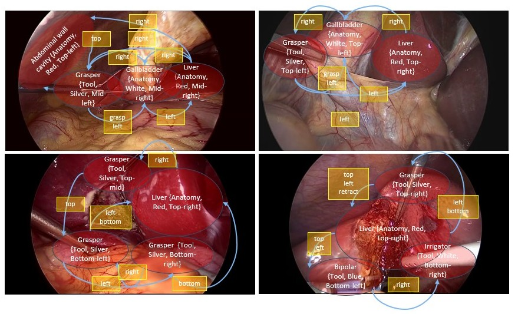
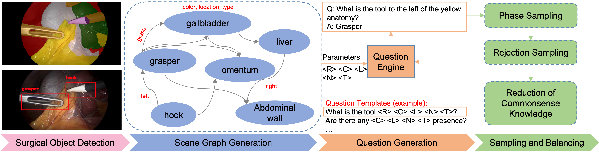
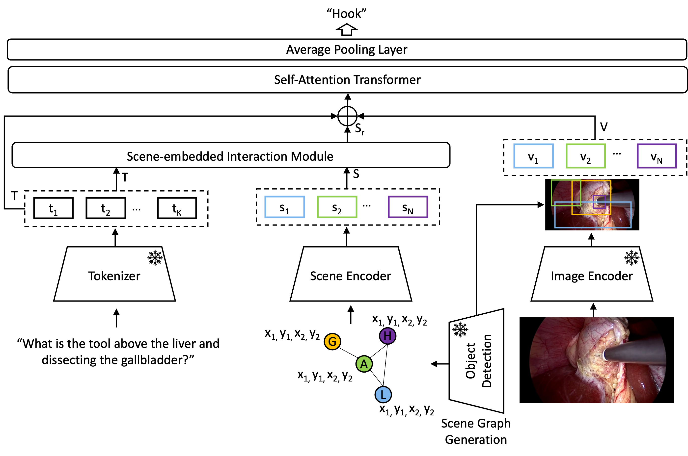

<div align="center">
<a href="http://camma.u-strasbg.fr/">

</a>
</div>


# **Advancing Surgical VQA with Scene Graph Knowledge**
_Kun Yuan, Manasi Kattel, Joel, L. Lavanchy, Nassir Navab, [Vinkle Srivastav](https://vinkle.github.io/), Nicolas Padoy_, 2023

<div align="center">

</a>
</div>

# $$\color{Blue} SSG-VQA \space Dataset $$

This repo contains an open-source PyTorch code and the dataset for the paper [Advancing Surgical VQA with Scene Graph Knowledge](https://arxiv.org/abs/2312.10251)


[](https://arxiv.org/abs/2312.10251)

## Introduction

The modern operating room is becoming increasingly complex, requiring innovative intra-operative support systems. While the focus of surgical data science has largely been on video analysis, integrating surgical computer vision with natural language capabilities is emerging as a necessity. Our work aims to advance Visual Question Answering (VQA) in the surgical context with scene graph knowledge, addressing two main challenges in the current surgical VQA systems: removing question-condition bias in the surgical VQA dataset and incorporating scene-aware reasoning in the surgical VQA model design.


First, we propose a **S**urgical **S**cene **G**raph-based dataset, SSG-VQA, generated by employing segmentation and detection models on publicly available datasets. We build surgical scene graphs using spatial and action information of instruments and anatomies. These graphs are fed into a question engine, generating diverse QA pairs. Our SSG-VQA dataset provides a more complex, diverse, geometrically grounded, unbiased, and surgical action-oriented dataset compared to existing surgical VQA datasets. We then propose SSG-VQA-Net, a novel surgical VQA model incorporating a lightweight Scene-embedded Interaction Module (SIM), which integrates geometric scene knowledge in the VQA model design by employing cross-attention between the textual and the scene features. 

Our comprehensive analysis of the SSG-VQA dataset shows that SSG-VQA-Net outperforms existing methods across different question types and complexities. We highlight that the primary limitation in the current surgical VQA systems is the lack of scene knowledge to answer complex queries. 

#### SSG-VQA dataset generation pipeline 
<!--  -->


#### SG-VQA-Net



# Get started

## Installation
## Environment
You need to have a Anaconda3 installed for the setup. We developed the code on Python 3.8, PyTorch 1.7.1, and CUDA 10.2.
```bash
$ git clone https://github.com/CAMMA-public/SSG-VQA.git
$ conda env create -f environment.yml
$ conda activate ssgvqa
```

## Downloads
#### Question-answer pairs
Download question-answer pairs from from our S3 server and unzip it into **./data/qa_txt** folder
```bash
(ssgvqa)$ wget https://s3.unistra.fr/camma_public/github/ssg-qa/ssg-qa.zip
(ssgvqa)$ unzip ssg-qa.zip -d ./data/qa_txt
```
#### Scene Graphs
We provide the scene graph in **scene_graph_ssgqa.zip** in .json format.          
The relationship is a list, where index is the subject of this relationship, and the index is the target, e.g., 'left': [[1, 2], [], []], means the 0 object is to the left of object 1 and 2.            
The image size that bounding boxes are corresponded to is (240, 430)   
#### Visual features
-  (Recommended) Download the features to train and test the model from our S3 server and unzip the files into folder **./data/visual_feats** folder   

```bash
(ssgvqa)$ wget https://s3.unistra.fr/camma_public/github/ssg-qa/cropped_images.zip
(ssgvqa)$ wget https://s3.unistra.fr/camma_public/github/ssg-qa/roi_yolo_coord.zip
(ssgvqa)$ unzip cropped_images.zip -d ./data/visual_feats
(ssgvqa)$ unzip roi_yolo_coord.zip -d ./data/visual_feats
```

- Or, create the features by yourself using the images from public [CholecT45](http://camma.u-strasbg.fr/datasets): 
```bash
(ssgvqa)$ python utils/feat_extract_visual.py
(ssgvqa)$ python utils/feature_extract_roi.py
```
### Model weights for the SSG-VQA-Net
Place the model weights in the [`checkpoints`](./checkpoints) directory
|   Model      |  Model Weights |
| :----------: | :-----:   |
| SSG-VQA-Net| [download](https://s3.unistra.fr/camma_public/github/ssg-qa/ssg-qa-net.pth.tar) |

#### Directory structure should look as follows.

```
# checkpoints: this is the folder in which all the weights are saved.           
# data: this is the folder in which in which all the the pre-extracted features are saved.

├──checkpoints      
│   ├── experiment1
│   │   └── Best.pth.tar
│   └── ...
├──data                   
│   ├── visual_feats
│   │   ├── cropped_images
│   │   │   └── VID01
│   │   │       └── vqa
│   │   │           └── img_features
│   │   │               └── 1x1
│   │   │                   └── 000001.hdf5
│   │   │                   └── ...
│   │   ├── roi_yolo_coord
│   │   │   └── VID01
│   │   │       └── labels
│   │   │           └── vqa
│   │   │               └── img_features
│   │   │                   └── roi
│   │   │                       └── 000001.hdf5
│   │   │                       └── ...
│   └── qa_txt
│       └── VID01
│           └── 1.txt
│           └── ...
└── ...
```       


## Training

```bash 
(ssgvqa)$ python train.py --validate=False   
```  


## Evaluation
```bash 
(ssgvqa)$ python test.py --validate=True --checkpoint checkpoints/ssg-qa-net.pth.tar
```    
Evaluate the performance in different complexity: set --dataset_type=ssg-qa-roi-analysis 
```bash 
(ssgvqa)$ python test.py --validate=True --dataset_type=ssg-qa-roi-analysis --checkpoint checkpoints/ssg-qa-net.pth.tar
```

## Results
The SSG-VQA dataset is a multi-class classification-based VQA dataset, we report the F1-Score in the table.
| Model   | Query Object |  Query Attribute | Existence | Counting  | Zero-hop | One-hop | Single-and | Mean |
|------:|:------:|:------:|:------:|:------:|:------:|:------:|:------:| :------:|
| SSG-VQA-Net | 49.4 | 60.0  | 75.8 | 28.6 | 58.2 |  52.4 | 38.4 | 54.9 |


## Citing SSG-VQA 
This dataset could only be generated thanks to the continuous support from our clinical partners. If you use this dataset, you are kindly requested to
cite the work that led to the generation of this dataset:
```bibtex
@article{yuan2024advancing,
  title={Advancing surgical VQA with scene graph knowledge},
  author={Yuan, Kun and Kattel, Manasi and Lavanchy, Jo{\"e}l L and Navab, Nassir and Srivastav, Vinkle and Padoy, Nicolas},
  journal={International Journal of Computer Assisted Radiology and Surgery},
  pages={1--9},
  year={2024},
  publisher={Springer}
}
```
[[`Download PDF`](https://arxiv.org/pdf/2312.10251.pdf)]


## Other works that have contributed to the generation of SSG-VQA dataset
```bibtex
@article{nwoye2022rendezvous,
  title={Rendezvous: Attention mechanisms for the recognition of surgical action triplets in endoscopic videos},
  author={Nwoye, Chinedu Innocent and Yu, Tong and Gonzalez, Cristians and Seeliger, Barbara and Mascagni, Pietro and Mutter, Didier and Marescaux, Jacques and Padoy, Nicolas},
  journal={Medical Image Analysis},
  volume={78},
  pages={102433},
  year={2022},
  publisher={Elsevier}
}
```
[[`Download PDF`](https://arxiv.org/pdf/2109.03223.pdf)]

```bibtex
@article{twinanda2016endonet,
  title={Endonet: a deep architecture for recognition tasks on laparoscopic videos},
  author={Twinanda, Andru P and Shehata, Sherif and Mutter, Didier and Marescaux, Jacques and De Mathelin, Michel and Padoy, Nicolas},
  journal={IEEE transactions on medical imaging},
  volume={36},
  number={1},
  pages={86--97},
  year={2016},
  publisher={IEEE}
}
```
[[`Download PDF`](https://arxiv.org/pdf/1602.03012.pdf)]

```bibtex
@inproceedings{jin2018tool,
  title={Tool detection and operative skill assessment in surgical videos using region-based convolutional neural networks},
  author={Jin, Amy and Yeung, Serena and Jopling, Jeffrey and Krause, Jonathan and Azagury, Dan and Milstein, Arnold and Fei-Fei, Li},
  booktitle={2018 IEEE winter conference on applications of computer vision (WACV)},
  pages={691--699},
  year={2018},
  organization={IEEE}
}
```
[[`Download PDF`](https://arxiv.org/pdf/1802.08774.pdf)]


```bibtex
@article{hong2020cholecseg8k,
  title={Cholecseg8k: a semantic segmentation dataset for laparoscopic cholecystectomy based on cholec80},
  author={Hong, W-Y and Kao, C-L and Kuo, Y-H and Wang, J-R and Chang, W-L and Shih, C-S},
  journal={arXiv preprint arXiv:2012.12453},
  year={2020}
}
```
[[`Download PDF`](https://arxiv.org/pdf/2012.12453.pdf)]


## License
This code, models, and datasets are available for non-commercial scientific research purposes as defined in the [CC BY-NC-SA 4.0](https://creativecommons.org/licenses/by-nc-sa/4.0/). By downloading and using this code you agree to the terms in the [LICENSE](LICENSE). Third-party codes are subject to their respective licenses.

By downloading and using this repo or dataset, you agree on these terms and conditions.

## Acknowledgement
This work has received funding from the European Union (ERC, CompSURG, 101088553). Views and opinions expressed are however those of the authors only and do not necessarily reflect those of the European Union or the European
Research Council. Neither the European Union nor the granting authority can be held responsible for them. This work was also partially supported by French state funds managed by the ANR under Grants ANR-20-CHIA-0029-01 and ANR-10-IAHU-02.

## CONTACT
This dataset was generated by the research group CAMMA: http://camma.u-strasbg.fr/. Any updates regarding this dataset can be found here: http://camma.u-strasbg.fr/datasets. Any questions regarding the dataset can be sent to kyuan@unistra.fr or srivastav@unistra.fr
